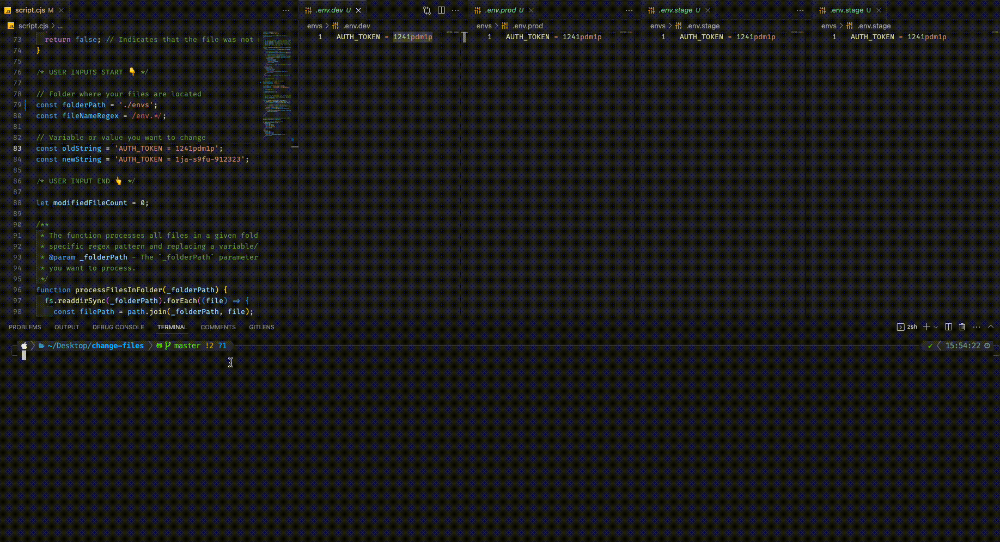

# change-files
# JavaScript File Modification Script

This script allows you to recursively search for and modify a specific variable name or value in multiple text files within a folder.

### Demo


## Usage
It changes similar text in multiple files with one single command.

### Prerequisites

- Node.js installed on your local machine.

### Getting Started

1. Clone this repository to your local machine:

   ```shell
   git clone https://github.com/is-harshul/change-files.git
   ```

2. Open the `script.js` and rename the following variables as per your need.
    ```
    /* USER INPUTS START 👇 */

      // Folder where your files are located
      const folderPath = './';
      const fileNameRegex = /env.*/;

      // Variable or value you want to change
      const oldString = 'AUTH_TOKEN = 1241pdm1p';
      const newString = 'AUTH_TOKEN = 1ja-s9fu-912323';

    /* USER INPUT END 👆 */
    ```
3. Execute the script
   ```shell
   npm start
   ```
   OR
   ```shell
   node script.js
   ```
Voila!
